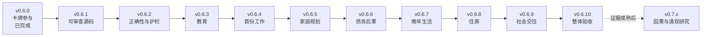

# v0.6.x 总体策略

状态：v0.6.0—v0.6.4 已发布；v0.6.5 已实现待发布；v0.6.6—v0.6.10 待实施
工程基线：每版实施前重新核对最新 `main`、`AGENT_HANDOVER.md`、版本常量和生成数据
规划依据：当前项目事实、既有五个事件簇、v0.6.0 审计及 `v0.6.x` 路线重构结论
实验参考：`investigate_card_game_mechanics` 仅作只读参考，保留到 v0.6.x 完成后再由用户决定是否清理

## 1. 路线目标

v0.6.x 的核心仍是丰富现有游戏，而不是提前把项目改造成模拟器、规则引擎或通用因果系统。

本阶段先用两个边界清晰的工程版本消除会污染后续内容的问题，再完成教育、首职、家庭、债务、晚年生活、住房、社会交往和整体验收：

1. v0.6.0：卡牌真正参与选择，已完成。
2. v0.6.1：建立可读、可审查、行为等价的运行时源码基线。
3. v0.6.2：修复已确认正确性问题，解除 index 语义耦合，建立生成期严格验证。
4. v0.6.3：教育年龄、复读与海外重申。
5. v0.6.4：首份工作与职业状态桥接。
6. v0.6.5：生育计划、怀孕决定与单身收养。
7. v0.6.6：债务执行与生活后果。
8. v0.6.7：晚年生活。
9. v0.6.8：住房。
10. v0.6.9：社会交往。
11. v0.6.10：跨系统验收、有限内容收口和 v0.7.x 研究入口整理。

`v0.6.1`—`v0.6.10` 共十个版本，必须各自保留一份独立 roadmap。晚年生活、住房和社会交往目前只建立占位边界，详细范围须在各版本开发前另行规划。

## 2. 顺序与依赖

依赖理由：

- v0.6.1 必须先于行为修复，使纯源码整理和游戏行为变化可以分别审查、验收和回滚。
- v0.6.2 必须先于新增事件簇，因为未知路径、指令、算子、断裂引用和 index 错位会随内容数量扩大。
- 教育出口先稳定，首份工作才能正确分层。
- 首职、收入和合同先稳定，家庭计划与债务才能读取可信上下文。
- 家庭在债务前完成，能为住房、照护、医疗和现金流后果提供成熟生活样本。
- 整体验收必须等待 v0.6.3—v0.6.9 的内容版本全部完成；它只收跨系统问题，不再增加大型玩法。

教育、就业、家庭、债务、晚年生活、住房和社会交往的现实研究可以提前并行，实施与验收仍按各自版本边界进行。

## 3. 版本与数据契约

| 版本 | Schema | Content Revision | 说明 |
|---|---:|---:|---|
| v0.6.0 | 11 | 20 | 当前已完成内容基线 |
| v0.6.1 | 11 | 20 | 源码等价整理，不改变玩家内容 |
| v0.6.2 | 11 | 20 | 运行时正确性与生成护栏；除版本元数据外，默认不改变生成内容 |
| v0.6.3 | 11 | 21 | 教育内容版本 |
| v0.6.4 | 11 | 22 | 首职内容版本 |
| v0.6.5 | 11 | 23 | 家庭内容版本 |
| v0.6.6 | 11 | 24 | 债务内容版本 |
| v0.6.7 | 11 | 25 | 晚年生活 |
| v0.6.8 | 11 | 26 | 住房 |
| v0.6.9 | 11 | 27 | 社会交往 |
| v0.6.10 | 11 | 28 | 整体验收与有限内容收口 |

统一规则：

- 游戏版本号必须在 `index.html`、`game.js`、生成器、`data.json`、README 和相关测试断言中一致。
- Content Revision 只在生成玩家内容发生有意变化时递增，不能用工程版本制造虚假的内容修订。
- Schema 11 是当前默认边界；任何 schema 变化、存档迁移或兼容策略都必须单独提交用户决定。
- 玩家内容只改 `content/zh-CN/` 和 `tools/generate-v5-data.mjs`，`data.json` 只能由正式生成器写出。
- 生成器连续运行两次，第二次不得产生差异。

## 4. 作者键的严格边界

v0.6.2 允许引入最小作者键，用来解除生成器内部 index／数组位置与作者配置之间的语义耦合。它不是运行时 ID，也不是第二套身份系统。

作者键只能：

- 存在于生成器内部定义或作者侧配置；
- 在生成期间稳定定位某条作者配置、效果映射、卡牌互动或见证文本；
- 在所属的局部作者表内保证必要的唯一性；
- 帮助证明插入或移动源定义不会改变无关内容语义。

作者键不得：

- 输出到 `data.json` 或任何运行时载荷；
- 进入 `run`、localStorage、存档、历史、图鉴、统计、延迟后果或来源字段；
- 出现在玩家可见数据、导出数据、调试导出或跨版本接口；
- 被 gameplay requirement、command、predicate 或运行时查找读取；
- 被用作现有事件 ID 的别名、替代品、双轨映射或跨版本兼容键；
- 扩张为全局注册表、通用身份层或第二套 ID 系统。

生成器必须有反向断言，确认作者键不会泄漏到输出。若未来确实需要跨版本稳定身份，必须停止并另行研究；不得沿用作者键偷偷承担该职责。

## 5. 必须复用的现有实现

- 保留当前 72 张卡、0／18／35／55 岁四次抽卡、每次三选一和抽卡时已有的一次性状态效果。
- 复用 `undergraduate_application`、`first_job_application`、`becoming_parent`、`adoption_process` 等现有事件簇，修正和扩展，不新建平行系统。
- 复用现有晋升、经营、裁员、转行、职业间歇和事件簇队列。
- v0.6.1 保持 `index.html` 直接加载 `game.js` 的静态部署方式，不预设 `src/`、bundler 或模块化构建链。
- 不移植实验分支的运行时模块化、跨局传承、关键词机制推断和共享事件对象修改方式。

## 6. 工程治理边界

### v0.6.x 必须解决

- `game.js` 可读、可审查，并有行为等价证据。
- 已确认的主冲突加权和年度健康边界问题。
- index／数组位置不再决定效果、卡牌互动或见证文本的业务语义。
- command、读写 path、operator、ID 和引用在生成期严格验证。
- 未知指令、路径或算子不能无痕退化成普通业务结果。
- 每个新增或修改的关键选择具有事件特异的卡牌参与方式。
- 自动契约、固定轨迹、浏览器路径、人工试玩和文案审查各自独立验收。

### v0.6.x 不解决

- 完整稳定语义 ID 迁移或双 ID 系统。
- 统一 provenance bus、复杂因果图、Reactive Rules 或参数化后果引擎。
- Headless 大样本模拟和以概率统计替代人工试玩。
- 完整 `src/`／modules／build 架构迁移。
- 全量重写旧卡牌互动、黑天鹅、episode catalog 或全项目文案。
- 未经产品判断启用 `priceIndex` 全局通胀或重定整个经济系统。

## 7. 执行与职责边界

每次只处理当前版本任务，不把十个版本一次性交给同一上下文。roadmap 只规定产品、工程、文案与验收责任，不指定开发执行者或推理档位。

- v0.6.3—v0.6.9 必须随实现交付可用文案，不能把模板化、事实越权或人物声音趋同全部留给 v0.6.10。
- v0.6.10 的核对目标是整体一致性、敏感表达和模板债收口，不是无差别重写已有好文案。

### 必须提前界定，执行者不得自行决定

- 功能是否加入、版本归属、年龄窗口、概率、学历层级、不可逆状态和玩家是否拥有拒绝权。
- 新增状态字段的含义、写入时机、唯一事实来源和旧字段兼容关系。
- 事件簇入口、阶段数、强制收束、失效条件和能否跨年龄。
- 卡牌能否突破硬限制、多个卡牌如何结算和覆盖率门槛。
- 作者键的用途和边界；不得将其输出或扩张为身份系统。
- 现实制度的采用或偏离；法律、医疗、教育和就业事实必须先有研究依据。
- 是否允许重构、迁移存档、修改 schema、扩大测试范围或改变发布流程。
- 提交、推送、PR、合并、部署、删除分支和其他外部或不可逆动作。

### 执行者可以自行处理

- 遵守现有模式的局部函数名、辅助函数拆分、条件组织和测试 fixture 写法。
- 在明确字段契约内选择最小实现方式，不改变公共行为。
- 为已确定机制补充必要的定向 contract、smoke 和浏览器步骤。
- 在既定事实、人物关系、地区和路线结果内编写具体生活细节。
- 修复由本版本改动直接导致、且只有一种合理行为的局部缺陷。

### 必须停止并交回用户

- 当前 `main` 与 roadmap 假设明显不一致。
- 两种以上产品行为都合理，而 roadmap 没有给出优先级。
- 必须改变年龄、概率、状态含义、路线结果、选项数量或玩家权利才能继续。
- 作者键必须进入运行时或跨版本接口才能实现当前方案。
- 生成器护栏要求改变既有合法数据语义，或位置解耦无法保持无关输出等价。
- 现实制度与既定游戏规则冲突，且文案无法诚实说明游戏化简化。
- 修复需要跨版本架构重写、删除大量现有内容或修改无关系统。
- 核心验收经一次有依据的修正和一次复测后仍无法解释。

## 8. 每个版本的标准任务包

每次任务至少包含：

1. 完整阅读 `AGENT_HANDOVER.md`、本文件、当前版本 roadmap、`CopyWriting_Guideline.md`、相关源文件和测试。
2. 只读核对当前 Git、版本常量、生成数据、现有验证器和实验参考点。
3. 明确本版本允许修改的子系统、明确不修改范围和状态字段契约。
4. 按优先级排列验收条件，并先核对验收器输入、工具、参数和断言。
5. 默认只允许本地实现与相称验证；不自动提交、推送、建 PR、合并或部署。

每个版本完成后开启新任务并重新读取最新实际状态。发现独立问题只记录，不顺手纳入当前版本。

v0.6.3—v0.6.9 完成时必须同时交付该版本的文案自检结果；不得以“v0.6.10 会整体复核”为由降低当前版本的文案完成标准。

## 9. 文案强制规则

所有玩家可见中文文案的编写、改写和审阅，必须先完整阅读并遵守根目录 `CopyWriting_Guideline.md`。

- 选择前只写所有可达路径共同成立的事实；选择后才写该选项产生的新事实。
- 不把内部状态、概率、路线名或作者键翻译成流程报告腔。
- 不默认玩家、伴侣、孩子或职业的性别和身份。
- 不把明确意愿写成已经发生的录取、怀孕、入职、执行或康复结果。
- 不为统一风格重写已有好文案。
- 文案修改后仍从源文件生成 `data.json`，连续运行生成器两次确认稳定。
- 文案授权不等于机制、测试、提交、推送、合并或部署授权。

## 10. 统一验证与发布规则

- `tests/run-checks.cjs` 是日常检查的唯一选择入口；无参数不得运行全量，`full` 只能由整体验收显式调用。
- `--changed` 根据明确路径选择 profile；`game.js`、生成器、共享轨道辅助等多领域文件必须补 `--scope`，不得猜测影响范围，也不得因歧义退回全量。
- 当前固定 profile 为 `syntax`、`fast`、`core`、`cards`、`family`、`education`、`career`、`episodes`、`runtime-refactor` 和 `full`。未来领域只有在真实测试存在时才登记 profile，不建空占位。
- 一个自然版本不自动新增顶层 smoke。跨版本都必须稳定的启动、存档和核心循环才进入 `core`；领域分支进入按需 regression；跨系统组合留在 release-only 验收。
- 每版只实现自己的功能切片；纯重构与玩法开发不得混版。
- 至少运行语法检查、当前版本定向检查、现有核心 smoke 和一条相关真实浏览器路径。
- 涉及卡片或抽屉时检查 360×773、360×640、320×568；控制台错误为 0。
- 浏览器验证必须区分“没有运行”“权限阻断”和“已通过”。
- 固定 seed 只用于版本内定向轨迹和问题复现，不承诺跨版本完全重放。
- 不运行批量人生模拟；自动测试只证明合同、边界和路径连通。
- 概率体验、数值平衡、文案质感和产品判断仍由人工试玩验收。
- 每版完成后先报告本地 diff、验证结果、未验证体验和剩余风险。
- 提交、推送、PR、合并、部署和分支清理分别等待用户授权。

## 11. v0.6.x 完成定义

v0.6.x 只有在以下条件全部满足后才结束：

- v0.6.1—v0.6.10 的独立验收条件分别通过。
- 可读源码基线和内容护栏持续有效，没有作者键泄漏。
- 卡牌覆盖与选项可达性检查没有假覆盖，新内容不是纯模板轮换。
- 年龄状态机不会生成 35 岁才进入普通首职、30 岁后常规全日制本科等异常路径。
- 首职状态可被晋升、经营、裁员、转行、家庭和债务读取。
- 家庭机会不会重复弹出，玩家决定权不被伴侣状态覆盖。
- 债务危机有严重后果，但不会造成无选择软锁或提前结束人生。
- 跨系统组合不存在已知的重复结算、断裂引用或静默非法状态。
- 全部新增文案通过 `CopyWriting_Guideline.md` 自检与人工混排阅读。
- v0.7.x 候选模式有来自至少三个独立领域的重复事实与维护成本证据。
- 用户完成最终试玩并决定是否进入后续合并、部署或 v0.7.x 研究。

## 12. v0.7.x 研究入口

v0.7.x 不预设必须采用因果图、Reactive Rules、参数化后果或 Headless 模拟器。只有多个成熟事件簇反复暴露相同底层结构，并已经造成具体重复、矛盾或维护瓶颈时，才启动有边界的研究／spike。

研究首先回答：

- 重复的是数据形状、触发机制、延迟后果，还是只有叙事主题相似；
- 最小抽象能消除哪些已经发生的问题；
- 哪些事件必须继续手写；
- 是否真的需要跨版本稳定身份、统一来源追踪或独立模拟入口。

作者键不参与这项研究的运行时身份设计，也不能被追认为既有跨版本接口。
